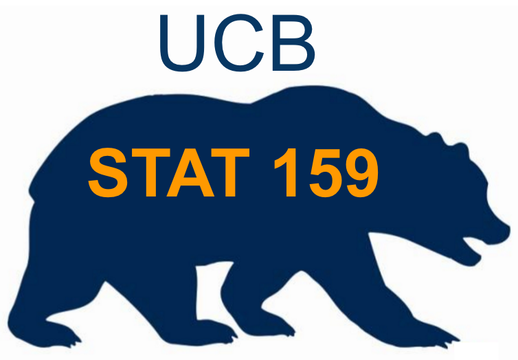

Stat 159 Project 1
==================

*Abigail Chaver*

September 30, 2016

Abstract
--------

In this paper, we consider industry standard tools for replicating
reports. We discuss version control systems and collaboration services,
formatting software, and replication tools. The purpose of this report
is to address benefits and challenges of these tools, and consider their
use in the wider context of computational research.

------------------------------------------------------------------------

Introduction
------------

Eliminating manual processes for replication is a huge boon to
computational research, and familiarity with these tools is essential
for any data scientist. We will look at the function of a Makefile, the
usefulness of Git and Github, and formatting tools Markdown and Pandoc.
We will also reflect on the challenges of learning these tools. This
project allows us to practice using these tools, and develop an
understanding of how these tools can help us execute more efficient
research.

Discussion
----------

### Makefiles

Makefiles automate the compilation of files. Most reports must be
compiled in a number of steps: generating plots and charts, organizing
content, and outputting a formatted file that can be easily consumed by
a reader. While working on a project, scientists will frequently make
changes to content or organization, and having to reassemble the final
file manually is repetetive and time-consuming. A makefile creates a
modular structure for the report, and executes its compilation through a
series of bash commands specified in the file. This allows the scientist
to change one part of the report and then update the file through a
single bash command.

Makefiles also represent the linear structure of report creation by
executing commands in order of dependency, so that, for example, a file
will never be formatted in pandoc before its plots have been generated.
In this way, the makefile provides a summary of the project, structured
from the most granular pieces of content to the highest level
compilation.

### Git

Git is a version control system which allows us to efficiently save
versions of files as they are edited so that we can return to previous
versions with ease. Git does this by tracking changes between
iterations, rather than saving full versions of the file at each stage.
At any point in time, Git can reconstruct previous versions of a file by
reversing the actions of the previous commits.

The process of changing a file through Git is a two-step process. When
the author has decided to record a new iteration of a file, they use the
command *git add* to add the new version of the file to the staging
area. Only after the file has been added to the staging area can it be
committed to the repository, where all of the previous tracked changes
are stored. The purpose of the staging area is to allow us to restrict
what is committed - we may have begun editing another file, but are not
ready to commit it as a new version, or we may have created files which
we do not want to commit. The staging area allows us to discriminate on
which files are committed and therefore which changes are executed in
the repository.

Git is a widely used tool for preventing the loss of functionality
through mistakes. It is especially popular for software development,
where large, convoluted projects with many dependencies can break when
any particular part is changed. Being able to see clearly what was
changed and revert back to old versions is extremely useful.

Git also uses the analogy of a tree to facilitate non-linear iteration.
By creating a new branch of a project, multiple authors can work
separately on parts of the project without worrying about each others
changes until they merge their branch into the master version. This
makes Git invaluable for large projects with many collaborators.

### Github

Github is a service that allows users to store repositories on a remote
server over the internet. This is incredibly powerful, because it allows
people on different networks to collaborate on the same project,
accessing the same up-to-date repositories through the internet. Github
is company that provides this service to companies and individuals, and
is used ubiquitously in software development. Github can be used through
the command line, like Git, but also provides a GUI on their website and
through a desktop app that allows users to commit and pull withouot
using terminal.

### Markdown

Markdown is a super low-barrier language for formatting text. Compared
to other markup languages like HTML, which allow users to format content
but also create complicated nesting structures, include scripts, and
complicated styling, Markdown is extremeley simple. It is much more like
a simple word processor - in fact, it contains even less functionality
than Microsoft Word. Many websites use markdown as the underlying format
for comments, posts, or emails, because it provides a bit of formatting
without going overboard on functionality. Markdown allows users to do
simple word formatting like bold and italic, create lists, and use a
hierarchy of headings. Markdown can also handle hyperlinks and images.
But overall, it is designed to be used without much knowledge of how to
visually customize a document. This makes it very accessible, especially
to people without any experience programming or even using markup
languages.

The benefit of Markdown is in its simplicity - besides being incredibly
easy to pick up, its established structure makes it easy to convert into
many filetypes. Since it possesses a very limited set of features, it
can be mapped into other formats without much concern for complicated
edge cases.

### Pandoc

Pandoc is a software that converts a large set of different markup
formats to each other. To do this, Pandoc reads an original file into a
native representation and then writes it into the specified format for
the output file. When there are differences in functionality between the
original file and the output file, or even the original file and the
native representation, characteristics from the original file can be
lost. An advantage of using markdown is that it restricts the user to
functionality which is ubiquitous in most other formats, so there is
rarely a problem with converting markdown to another file format.

------------------------------------------------------------------------

Conclusion
----------

The tools discussed in this paper are widely used, largely due to the
fact that they are free. A huge advantage of using popular tools like
these is that there is a huge body of documentation, both official and
not. The publishers of the tool provide very useful materials for
learning, but there is a plethora of tutorials, videos, and blogs
published by individuals that new users can learn from. Websites like
StackOverflow also allow users to find examples of solutions to problems
similar to theirs, and ask new questions of experts. It's quite
remarkable how much valuable learning material is accessible for free
over the internet.

Overall, these tools were quite easy to pick up. The majority of the
time working on this project was spent on writing content, not on
putting pieces of the report together. Probably the most challenging
tool to use for this projects and in past projects is git - it's really
necessary to understand the mental model of how files are committed and
reverted, and the commands are not always intuitive. However, Git and
Github are probably the most powerful tools of the set, and it's because
of this model of version control that it can do so much. It's an
extremely valuable skill to learn.

I was able to complete the work without any hands-on help, but I used
plenty of tutorials and resources I found online. Whenever I got stuck
on a small bug, I was able to google my problem and find a quick
solution. The entire project took about 3 hours; it felt pretty
manageable. It was really helpful to get practice with Git and Github,
and to construct a makefile. This project was a helpful excercise in
getting familiar with these tools.
